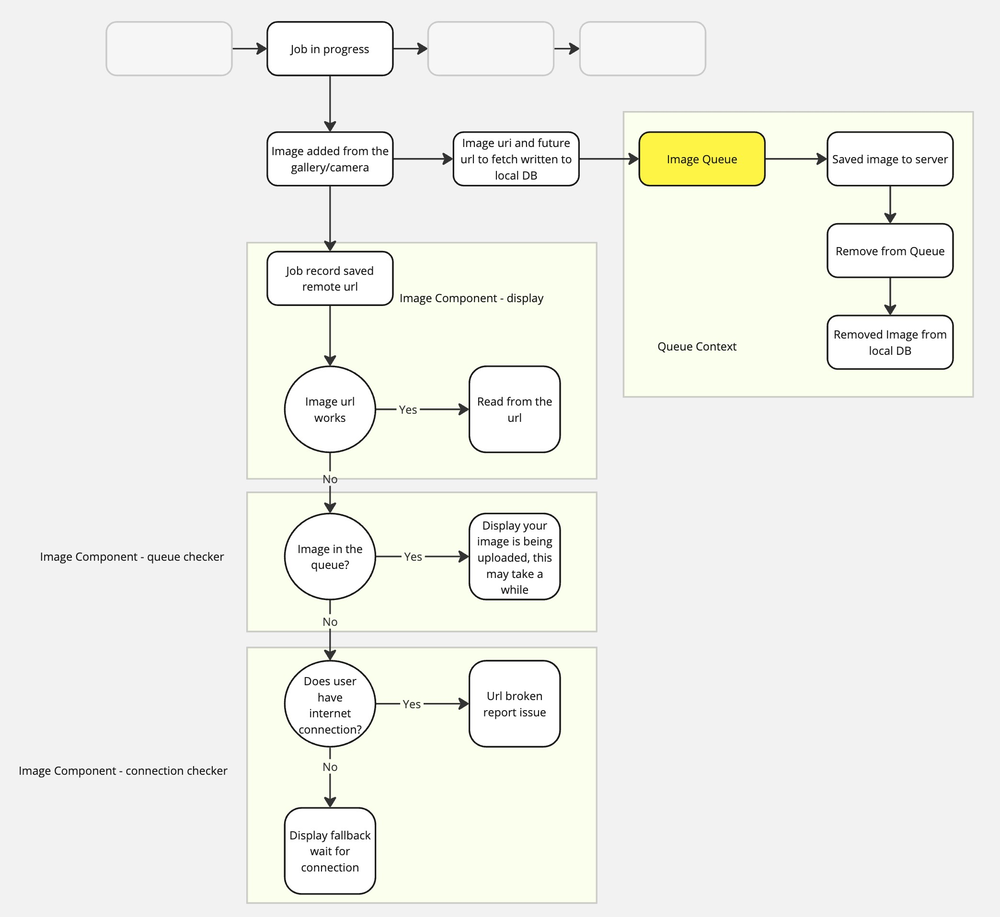

# Image Queue Context

This context was created to manage image uploads in scenarios where internet connectivity may not be consistent. The main goal is to ensure a seamless user experience by queuing images for upload when the network is available and preserving unsent images during offline periods.

## Features

- Queue management for image uploads.
- Automatic upload when the internet connection is restored.
- SQLite-based local storage for queue persistence.
- REST API integration for server-side processing.

## Endpoints

The API exposes several endpoints to handle image uploads and processing:

- `POST /api/upload-photos` : Accepts images for upload.
- `GET /api/photos/{confirm_name}.{confirm_extention}` : Retrieves uploaded images.

## How It Works

1. Images are added to a local SQLite queue.
2. If there is no internet connection, images stay in the queue.
3. Once the connection is restored, the images are uploaded automatically.

## API Documentation

For detailed API documentation, visit:

- `https://test.ecomdata.co.uk/api/redoc/`
